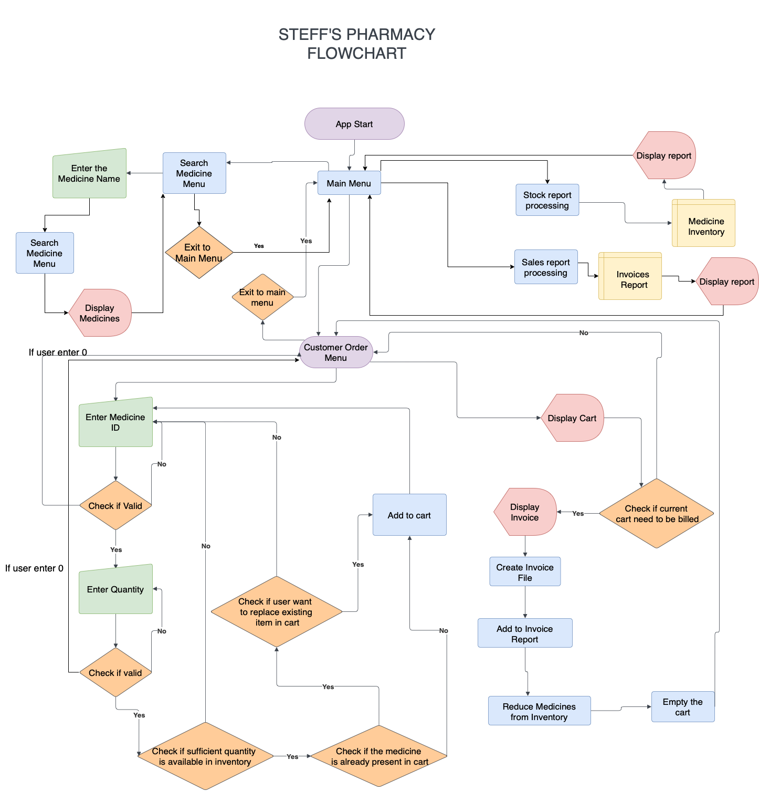
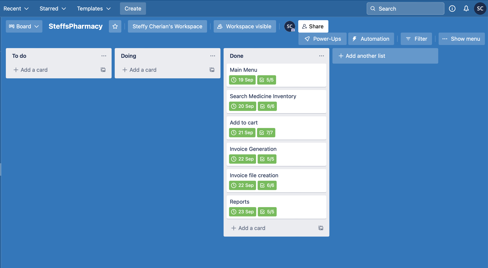
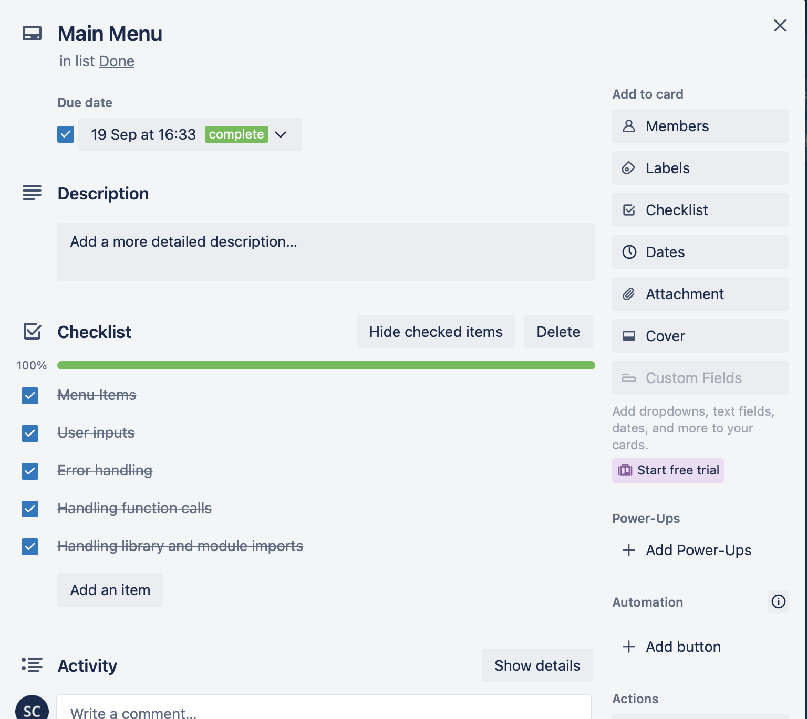
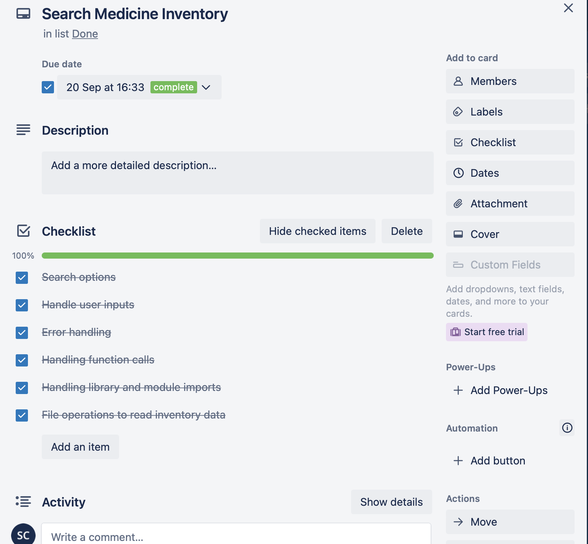
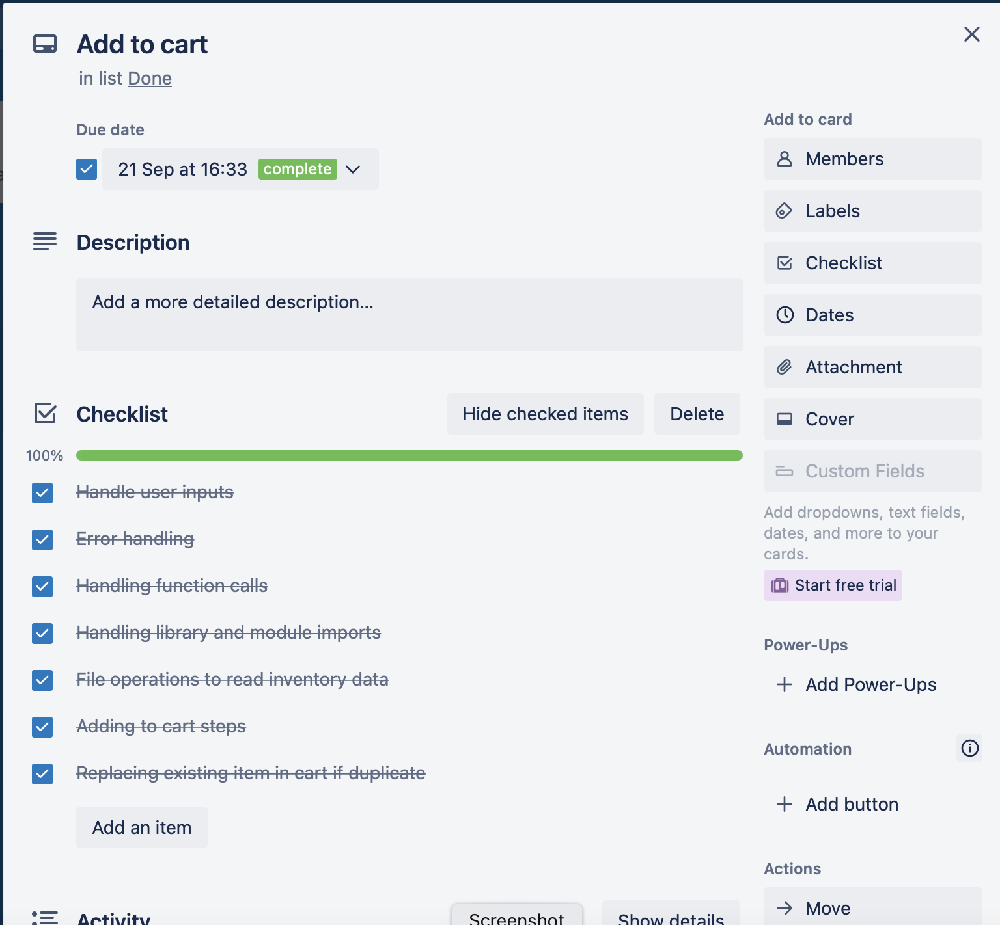
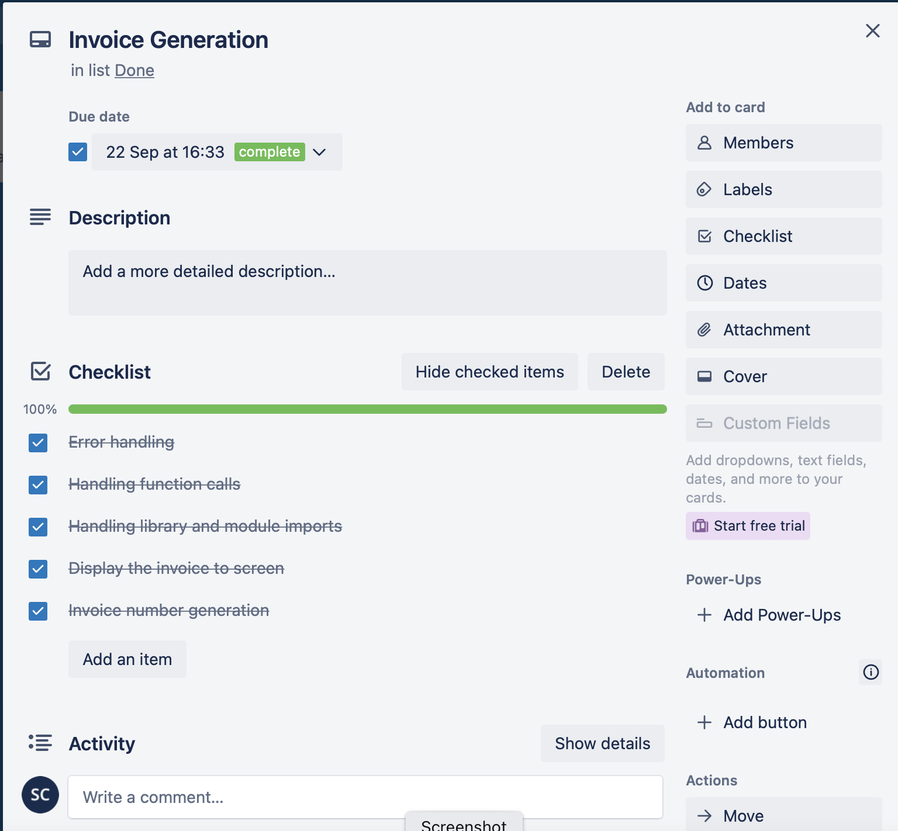
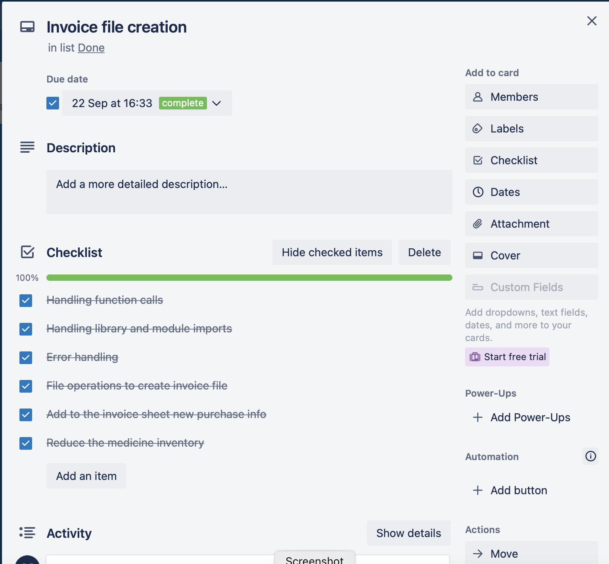
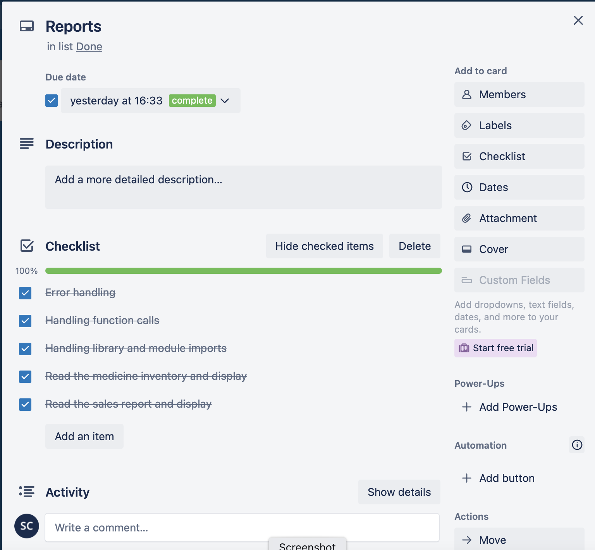

# SteffyJohnson_T1A3 -  Terminal Application

# MEDIA LINKS
[github repo](https://github.com/Steff4evr/pharmacy)

[Youtube link - SteffyJohnson_T1A3 - STEFFSPHARMACY](https://youtu.be/qnbcRS6UU2Y)

# STEFFS PHARMACY

## CODE STYLING
### PEP 8 - Styling
The formatting is as per the guidances mentioned in the PEP8  guide - 
https://peps.python.org/pep-0008/#package-and-module-names

## FEATURES

### FEATURE 1 : SEARCH FOR MEDICINE IN THE PHARMACY INVENTORY
The basic feature of the Steffs Pharmacy app is the search feature. Here, the user can search for the medicines that are available for the customers to order. The inventory sheet is read using  openpyxl library. The rows in the excel sheet is traversed using a 'for' loop. The user input is compared against each cell in the medicine name column in the inventory excel. The matching is done using regex library. If the medicine pattern is found then display the relevent fields of the inventory item. If no matches are found then display message informing the same. If-else control statements are used for this. The user is provided the option to  perform searches until they are done. All exceptions are handled in the appropriate manner with proper messages displayed to the user. The user inputs are placed in the try except block to control the same.

### FEATURE 2 : ADD MEDICINES TO CART
When the user of the application gives an order from the customer, the user  will first search for the medicine in the inventory. Once confirming that the medicine is available, the user will use the med-id to add the medicine to the cart. The user has to enter the med-id and the quatity of the medicine needed. Invalid inputs are captured by a try-except block. The inventory excel sheet is opened using openpyxl and traversed using a for loop. Once the matching med_id is founnd, there is further check to ensure that enough quatity is available.If sufficient quantity is not available then a flag is set and the user is prompted to re-renter the med id and quantity. If the quantity is available then the medicine is added to the cart. This check is performed using an If-else control statements. The items in cart are displayed after each item is successfully added to the cart. While adding a medicine to the cart, if the med-id is already present in the cart, then the user is prompter to  confirm if they need to replace the existing item in the cart. If user confirms 'y', then the item in cart is replaced with new item, else there wont be any change in cart. The whole process is looped in a while loop as more medicines can be added to the cart, the loop can be exited when the user enters the value '0' for the med-id or the quantity inputs.

### FEATURE 3 : BILLING AND GENERATION OF INVOICE
This feature is used to bill the items that are present in the medicine cart generate an invoice file which is physically storedin the local disk. The user confirmation is received whether to bill the items present in the cart. The invoice is displayed in a tabulated form using the tabulate library. A unique invoice number is generated using the current date and timestamp in the format SPddmmyyyyHHMMSS. After this, the invoice is then stored as a file in the same path as the inventory and invoices sheets. The items that are billed is then stored into the invoice excel file along with the invoice number. ALl items for the same bill will have the same invoice number. After the billing is completed, the quatity that is purchased will be reduced from the medicine inventory excel sheet. Finally, the cart is cleared so that the new customer order can be started.

### FEATURE 4 : DISPLAY STOCK REPORT 
Generation of stock report helps to keep track of the inventory. The medicine inventory excel is read using pandas read_excel function. The dataframe is then displayed on to the screen without any filters applied. 

### FEATURE 5 : DISPLAY SALES REPORT
The sales report is used for the user to understand the overall sales completed. The sales excel is read using pandas read_excel function. The dataframe is then displayed on to the screen without any filters applied.

## FLOWCHART

## TEST CASES :
 

## IMPLIMENTATION PLAN

### Trello : Project Management

### Trello : Menu

### Trello : Medicine Inventory

### Trello : Add to cart

### Trello : Invoice generation

### Trello : Invoice file creation

### Trello : Reports

## HELP SECTION

### Steps to Install
1. From Git hub repo , download the pharmacy repo. Link provided below.
2. [github repo](https://github.com/Steff4evr/pharmacy)
3. Unzip the downloaded zip file.

### Running the app.
Run the steffspharmacy.sh shell script present in folder pharmacy/ using terminal application like CYGWIN in windows
run as - './steffspharmacy.sh' and hit enter key

### Dependecies
Python3 vesion should be already isntalled. 
Most of the libraries used are installed as part of the app run.

### System requirements 
Linux- Ubuntu 16.04 to 17.10, or Windows 7 to 10, with 2GB RAM (4GB preferable)

